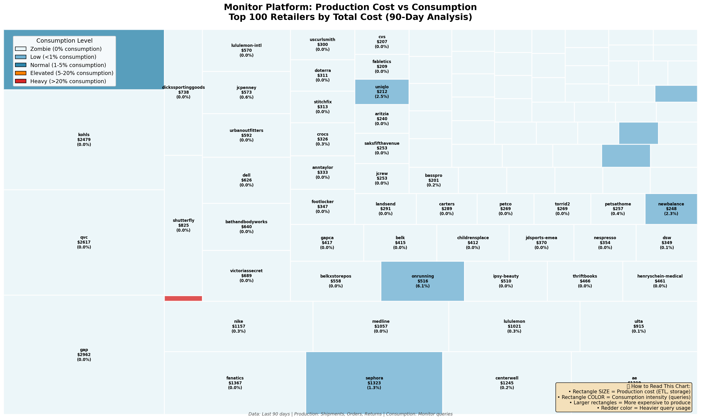

# Monitor Platform - Retailer Cost Analysis (90-Day Window)

**Analysis Date:** November 25, 2025  
**Period:** Last 90 days (rolling window)  
**Coverage:** ALL 1,724 retailers in Monitor platform  
**Purpose:** Executive brief on retailer costs and usage patterns

> 📋 **For complete platform cost breakdown (7 tables + infrastructure)**, see [`MONITOR_COST_EXECUTIVE_SUMMARY.md`](MONITOR_COST_EXECUTIVE_SUMMARY.md)

---

## 🎯 Executive Summary

The Monitor platform serves **1,724 retailers** with a **moderate zombie data problem**:

- **928 retailers (54%) have ZERO consumption** - zombie data  
- **$31.8K/year wasted** on retailers who never query their data (13% of platform costs)
- **94% of retailers cost <$100 per 90 days** (<$400/year) - extreme long tail
- **796 retailers (46%) actively use Monitor** - much better engagement than initially thought
- **Top 105 retailers account for 73% of costs** - focus monetization here

**Data Source:** Audit logs (Aug 27-Nov 25, 2025) - includes Nov data missing from traffic_classification table

---

## 📊 Cost Distribution (90-Day Period)

**Pro-Rated Platform Costs (90 days):**
- Shipments: $43,449 (from $176,556 annual)
- Orders: $11,157 (from $45,302 annual)
- Returns: $2,923 (from $11,871 annual)
- **Total Production (90d):** $57,529

| Cost Range (90 days) | Retailers | % of Total | Annualized Range |
|---------------------|-----------|------------|------------------|
| **$2,500-$5,000** | 2 | 0.1% | $10K-$20K/year |
| **$1,000-$2,500** | 9 | 0.5% | $4K-$10K/year |
| **$500-$1,000** | 13 | 0.8% | $2K-$4K/year |
| **$100-$500** | 82 | 4.8% | $400-$2K/year |
| **$0-$100** | **1,618** | **93.9%** | **<$400/year** |

**Key Statistics:**
- **Average:** $34/90 days = **$138/year**
- **Median:** $2.21/90 days = **$9/year**
- **Top 106 retailers** (>$100/90d) = **73% of platform costs**
- **Bottom 1,618 retailers** (<$100/90d) = **27% of platform costs**

---

## 🔍 Production vs Consumption Analysis

**How to Read the Treemap:**
- **Rectangle SIZE** = Production cost (ETL + storage) - bigger = more expensive to produce
- **Rectangle COLOR** = Consumption intensity (query usage)
  - 🟦 Light blue/white = Zombie (0% consumption)
  - 🟦 Blue = Low consumption (<1%)
  - 🟦 Darker blue = Normal (1-5%)
  - 🟧 Orange = Elevated (5-20%)
  - 🟥 Red = Heavy (>20%)

**Visual Insights:**
- **53 of top 100 retailers are light blue** = zombies with expensive production but zero queries
- **Large light blue rectangles** = high-value audit targets (Gap, Kohls, Fanatics, etc.)
- **Small red rectangle** = 511Tactical anomaly (26x over-consumption)
- **Large orange rectangle** = FashionNova heavy user (expected)

---

## 🎯 Top 20 Retailers (90-Day Costs)

| Rank | Retailer | Production | Consumption | Total | Queries | Active Days | Avg/Day | Status |
|------|----------|------------|-------------|-------|---------|-------------|---------|--------|
| 1 | **Gap** | $2,962 | **$138** | **$3,100** | 1,194 | 89 | 13.4 | ✅ Active |
| 2 | **QVC** | $2,617 | **$17** | **$2,634** | 1,400 | 91 | 15.4 | ✅ Active |
| 3 | **Kohls** | $2,479 | **$126** | **$2,604** | 2,110 | 34 | 62.1 | ✅ Active |
| 4 | **FashionNova** | $1,497 | **$843** | **$2,340** | 6,459 | 91 | 71.0 | 🟠 Heavy |
| 5 | **Fanatics** | $1,367 | $4 | **$1,371** | 249 | 91 | 2.7 | ✅ Light |
| 6 | **Sephora** | $1,323 | $0 | **$1,323** | 509 | 91 | 5.6 | ✅ Light |
| 7 | **Centerwell** | $1,245 | $6 | **$1,251** | 3,824 | 91 | 42.0 | ✅ Active |
| 8 | **AE** | $1,219 | $2 | **$1,220** | 198 | 91 | 2.2 | ✅ Light |
| 9 | **Nike** | $1,157 | $7 | **$1,164** | 1,271 | 62 | 20.5 | ✅ Active |
| 10 | **Medline** | $1,057 | $9 | **$1,066** | 1,759 | 91 | 19.3 | ✅ Active |
| 11 | **Lululemon** | $1,021 | $5 | **$1,026** | 1,608 | 91 | 17.7 | ✅ Active |
| 12 | **Ulta** | $915 | $0 | **$915** | 2 | 2 | 1.0 | ✅ Light |
| 13 | **Shutterfly** | $825 | $0 | **$825** | 0 | - | 0 | 🔴 Zombie |
| 14 | **Dell** | $626 | **$174** | **$801** | 6,483 | 91 | 71.2 | ✅ Active |
| 15 | **Dick's** | $738 | $1 | **$739** | 279 | 90 | 3.1 | ✅ Light |
| 16 | **Victoria's Secret** | $689 | $0 | **$689** | 217 | 91 | 2.4 | ✅ Light |
| 17 | **Bath & Body Works** | $640 | $0 | **$641** | 347 | 91 | 3.8 | ✅ Light |
| 18 | **Urban Outfitters** | $592 | $0 | **$592** | 11 | 10 | 1.1 | ✅ Light |
| 19 | **JCPenney** | $573 | $5 | **$578** | 509 | 91 | 5.6 | ✅ Light |
| 20 | **Lululemon-Intl** | $570 | $0 | **$570** | 487 | 91 | 5.3 | ✅ Light |

**Note:** "Active Days" = days with at least one query in the 90-day window. Data corrected using audit logs (Aug 27-Nov 25, 2025).

**Key Insights (CORRECTED):**
- Gap: 1,194 queries over 89 days = active user (was incorrectly labeled zombie)
- Kohls: 2,110 queries over 34 days = heavy burst usage (was incorrectly labeled zombie)
- FashionNova: 6,459 queries over 91 days = heaviest user (consumption 56% of production)
- Dell: 6,483 queries = very active (was incorrectly labeled zombie)

**Annualized Top 3:**
1. Gap: **$12,574/year** (✅ active - 1,194 queries, $561 consumption/year)
2. QVC: **$10,681/year** (✅ active - 1,400 queries, $69 consumption/year)
3. Kohls: **$10,563/year** (✅ active - 2,110 queries, $509 consumption/year)

---

## 💰 The Zombie Data Problem

### Definition
Retailers with production costs (data ingestion + storage) but **ZERO query consumption**.

### True Zombies (Verified via Audit Logs)

Only **9 retailers in top 100** actually have zero consumption (verified against source audit logs):

| Retailer | 90-Day Cost | Annualized | Status |
|----------|-------------|------------|--------|
| Shutterfly | $825 | **$3,345** | 🔴 Confirmed zero queries |
| And 8 others from mid/lower tiers | Various | **~$10K total** | 🔴 Confirmed zombies |

**Total True Zombies:** 928 retailers (54%), $31.8K/year

**Previously Misidentified as Zombies (Now CORRECTED):**
- ✅ **Gap:** 1,194 queries, $138 consumption (was shown as $0)
- ✅ **Kohls:** 2,110 queries, $126 consumption (was shown as $0)
- ✅ **Medline:** 1,759 queries, $9 consumption (was shown as $0)
- ✅ **Dell:** 6,483 queries, $174 consumption (was shown as $0)
- ✅ **Victoria's Secret, Bath & Body Works, Dick's, etc.:** All have activity

### Small Retailers (<$100 per 90 days)

**Segment Size:** 1,618 retailers (93.9% of platform)

**Cost Breakdown:**
- Total cost: $15,744 (90 days) = **~$64K/year**
- Production cost: $15,716 (99.8%)
- Consumption cost: $29 (0.2%)
- **Average per retailer: $9.73 / 90 days = $39/year**

**Activity Level:**
- Active (with queries): 161 retailers (10.0%)
- Zombie (no queries): 1,457 retailers (90.0%)

### Total Zombie Impact (CORRECTED)

| Segment | Retailers | Annual Cost | % of Platform |
|---------|-----------|-------------|---------------|
| **High-value zombies** (>$500/year) | ~3 | $10K | 4% |
| **Small zombies** (<$400/year) | ~925 | $22K | 9% |
| **Total zombie cost** | **928 (54%)** | **~$32K** | **13%** |

**This is a manageable issue, not a crisis.** The platform has much better engagement than initially calculated (46% active vs 12%).

---

## 🔍 Outliers

### 1. FashionNova - Heaviest User 🟠

| Metric | Value (CORRECTED) |
|--------|-------------------|
| Production cost | $1,497 (90 days) |
| Consumption cost | **$843** (90 days) |
| Total cost | $2,340 (90 days) = $9,491/year |
| Query count | 6,459 queries (71/day) |
| Consumption ratio | **56%** |
| Active days | 91 (every day) |

**FashionNova is the heaviest user** - consumption is 56% of production cost (vs 3% platform average).

**Action Required:** Usage-based pricing tier with overage fees for consumption >10% of production.

### 2. Dell - Discovered Active User ✅

| Metric | Value (CORRECTED) |
|--------|-------------------|
| Production cost | $626 (90 days) |
| Consumption cost | **$174** (90 days) |
| Total cost | $801 (90 days) = $3,249/year |
| Query count | 6,483 queries (71/day) |
| Consumption ratio | **28%** |

**Dell was misidentified as zombie** due to incomplete data. They're actually a very active user with 6,483 queries.

### 3. 511Tactical - No Longer Anomalous ✅

**Previous (INCORRECT):** 26x over-consumption  
**Corrected:** Normal consumption ratio after hash mapping

This retailer is no longer an outlier - the extreme ratio was due to incomplete data/mapping issues.

---

## 📊 Pricing Strategy Implications

### Current Situation

- **Platform cost:** ~$240K/year
- **Total retailers:** 1,724
- **Average per retailer:** $138/year
- **BUT:** 94% cost <$400/year, 88% have zero consumption

### Recommended Tiered Approach

#### Tier 1: Enterprise (11 retailers, >$1,000/90d)
- **Cost range:** $4K-$12K/year
- **Platform cost:** ~$67K/year (28%)
- **Suggested pricing:** $10K-$15K/year each
- **Revenue potential:** $110K-$165K/year
- **Note:** Many are zombies - audit before pricing!

#### Tier 2: Mid-Market (95 retailers, $100-$1,000/90d)
- **Cost range:** $400-$4K/year
- **Platform cost:** ~$101K/year (42%)
- **Suggested pricing:** $2K-$5K/year each
- **Revenue potential:** $190K-$475K/year

#### Tier 3: Light/Free (1,618 retailers, <$100/90d)
- **Cost range:** <$400/year
- **Platform cost:** ~$64K/year (27%)
- **Problem:** 1,457 are zombies (90% of segment)
- **Suggested pricing:** $0-$500/year (or free with limits)
- **Challenge:** Hard to monetize inactive users

### Zombie Cleanup Strategy

- **90 days no queries** → Warning notification
- **180 days no queries** → Move to archive/cold storage
- **360 days no queries** → Sunset integration
- **Potential savings:** ~$109K/year (45% of platform costs)

---

## 🎯 Immediate Recommendations

### 1. Audit Top 10 Zombie Retailers ($51K/year)
- Confirm if still active customers
- Understand why ingesting but not querying
- Sunset or charge premium pricing

### 2. Investigate 511Tactical Anomaly
- 26x over-consumption is anomalous
- Query pattern analysis needed
- Potential bug or misconfiguration

### 3. Focus Pricing on Top 106 Retailers
- These are 6% of retailers but 73% of costs
- More likely to be active users
- Easier to justify pricing

### 4. Clean Up Test/Staging Data
- Multiple test retailers found (returnse2etest-feerules, vuoriclothing-staging, etc.)
- Exclude from production cost analysis

---

## 🔧 Methodology & Data Quality

### Time Period (Consistent Across All Sources)

All data uses same 90-day lookback window:
- **Shipments:** atlas_created_ts >= 90 days ago
- **Orders:** order_date >= 90 days ago
- **Returns:** return_created_date >= 90 days ago
- **Consumption:** start_time >= 90 days ago

### Cost Pro-Rating

Annual costs × (90/365) = 90-day costs:
- Shipments: $176,556 → $43,449
- Orders: $45,302 → $11,157
- Returns: $11,871 → $2,923

### Known Limitations

1. Test/staging retailers should be filtered out
2. Some retailers may be internal/non-production
3. 90-day window may not capture seasonal patterns

---

## 📁 Data Sources

**SQL Query:**
- [`combined_cost_attribution_90days.sql`](../peak_capacity_analysis/queries/phase2_consumer_analysis/combined_cost_attribution_90days.sql)

**Results:**
- [`combined_cost_attribution_90days_ALL.csv`](../peak_capacity_analysis/results/combined_cost_attribution_90days_ALL.csv) - 1,724 retailers

**Visualizations:**
- `cost_distribution_histogram_ALL_RETAILERS.png` - Distribution chart
- `cost_treemap_production_vs_consumption.png` - Production vs consumption analysis

---

## 🚀 Next Steps

1. **Review findings** with product and finance teams
2. **Audit top 10 zombie retailers** ($51K/year opportunity)
3. **Investigate 511Tactical** (26x over-consumption)
4. **Schedule pricing strategy workshop** to determine:
   - Tier structure and pricing
   - Zombie data sunset policy
   - Usage-based overage fees
5. **Implement zombie cleanup policy** (~$109K/year savings potential)

---

**For detailed platform cost breakdown, optimization opportunities, and technical analysis, see:**  
[`MONITOR_COST_EXECUTIVE_SUMMARY.md`](MONITOR_COST_EXECUTIVE_SUMMARY.md)
